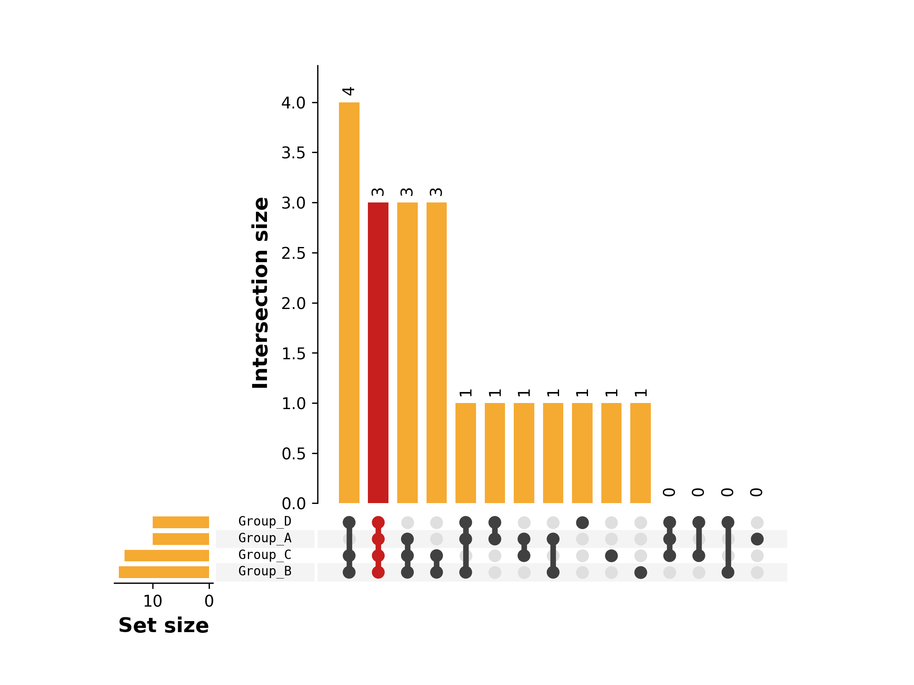
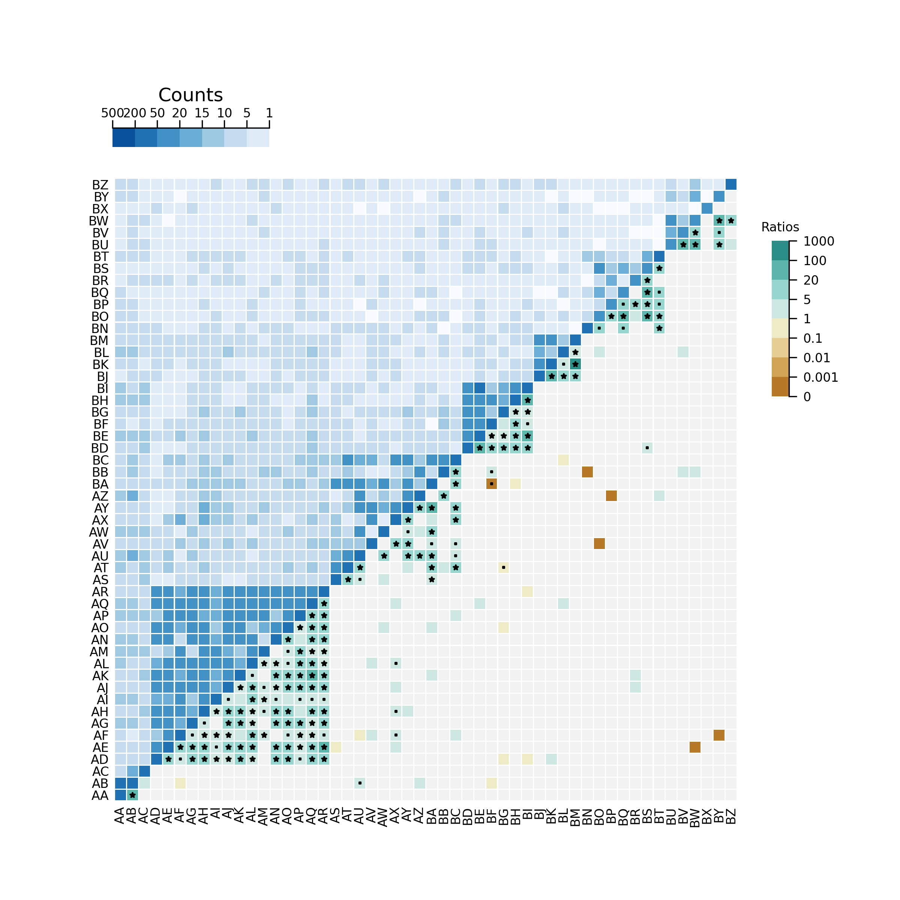
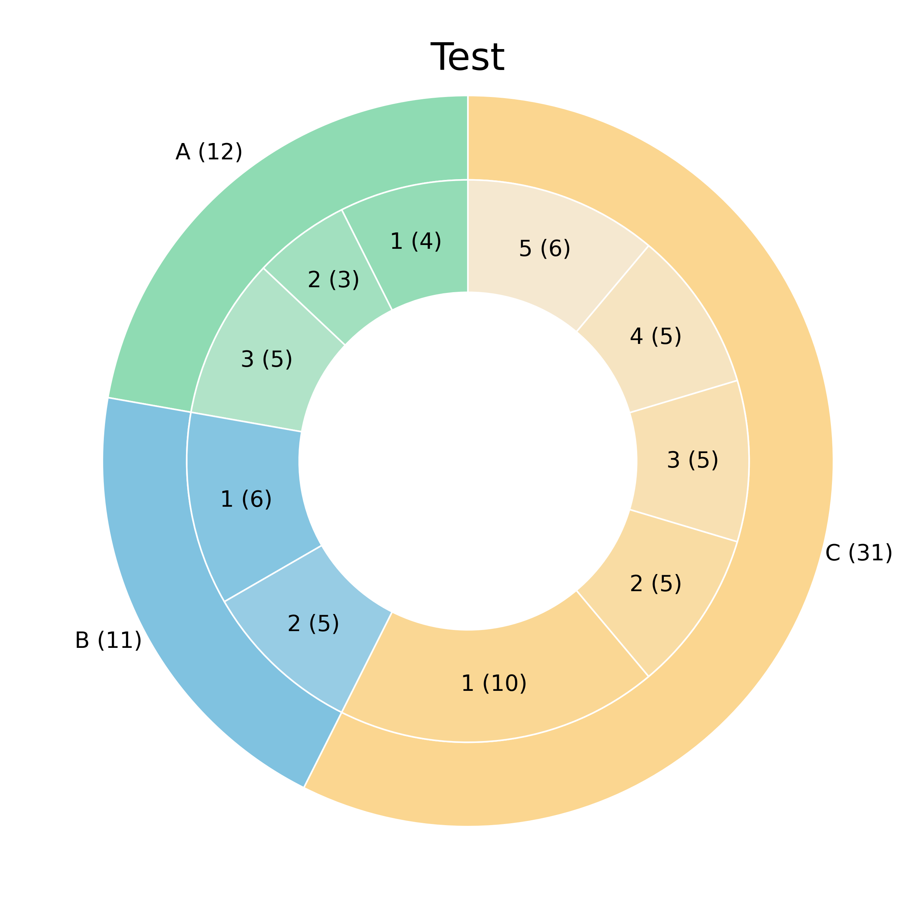

# PrettyPy 

PrettyPy is a `Python` package that implements nice functions for plotting complex and/or pretty graphics for
visualizing data or displaying analysis results.

## 1. Upset plots

The `upset` subpackage of the prettypy package defines a function for plotting upset plots. It mirrors the style of the
R package `UpSetR` available at [https://github.com/hms-dbmi/UpSetR](https://github.com/hms-dbmi/UpSetR). The current
implementation was copied from [https://github.com/ImSoErgodic/py-upset](https://github.com/ImSoErgodic/py-upset) and is
kind of much slower than the `UpSetR` implementation.

Here is an example of rendering on a simulated example.

## 2. Heatmap plots

### 2.1 Double heatmap

The `double_heatmap` subpackage of the `prettypy` package defines functions for plotting heatmaps of two half-filled
matrices. The function additionally allows to add scattered markers on the half-filled matrices to highlight some cells.

The `double_heatmap` plot in the demo was inspired by the figure S3.a of [the
supplementary](https://www.nejm.org/doi/suppl/10.1056/NEJMoa1516192/suppl_file/nejmoa1516192_appendix.pdf) of the paper
Elli Papaemmanuil, Ph.D., Moritz Gerstung, et al. "Genomic Classification and Prognosis in Acute Myeloid Leukemia".
NEJM, 2016.

## 3. Donut plot

Inspired by the plot [here](https://python-graph-gallery.com/donut-plot/) and the code mentioned in the comments by the
author.

## 4. Venn plot

Based on the functions provided by the [matplotlib-venn](https://pypi.org/project/matplotlib-venn/) Python library.

